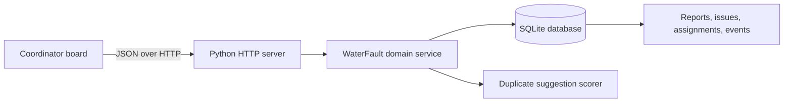

# Architecture

The prototype deliberately uses the Python standard library and browser-native JavaScript so it can run without dependency installation. The HTTP server serves the application and a small JSON API. Domain operations own validation and write to the existing normalized SQLite foundation inside explicit transactions.

Implemented domain operations:

- `create_report`: stores an original report and returns possible duplicate issues.
- `link_report`: requires coordinator confirmation and never deletes the report.
- `assign_crew`: rejects a second active assignment at both domain and database levels.
- `resolve_issue`: completes the active assignment, resolves the issue, and records an event.
- `get_state`: returns the board, inbox, crews, assignments, and history.

Duplicate detection is advisory: a small deterministic scorer compares landmark and description tokens, then a person confirms the link. Every database connection enables foreign keys. The partial unique index remains the final guard for one active assignment per issue.

The browser also feature-detects WebMCP and exposes the same report, link, assignment, resolution, and read actions when a supporting browser is available. The visible interface and agent surface call the same API.

This is a local prototype architecture, not an operational utility system. A production deployment would add authentication, rate limiting, audit identity, privacy controls, notifications, geospatial matching, and managed durable storage.
